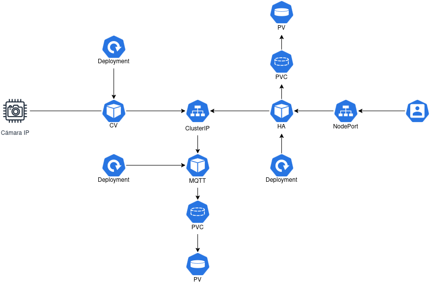

# 🎓 Taller introductorio a Kubernetes

¡Hola! En este taller vamos a realizar el despliegue de un proyecto muy básico de aula inteligente basada en Home Assistant (HA) empleando Kubernetes.

Aprenderemos a crear un clúster de Kubernetes usando `microk8s` en varias máquinas virtuales que pueden estar en ordenadores distintos, crearemos **Deployments** para lanzar nuestros contenedores, utilizaremos **volumenes** para almacenar datos y usaremos **servicios** para poder acceder a nuestro aula inteligente.

---

## 📚 Material de apoyo
A continuación, os adjuntamos una serie de recursos para poder consultar los conceptos teóricos que vamos a gastar en el taller:

* **[📽️ Presentación del taller]():** — *Aquí encontrarás un resumen de los conceptos clave.*
* **[📖 Documentación (Wiki)](https://marcelosaval.github.io/Wiki-IMCR/Cloud%20Computing/KubernetesYCloudComputing/):** — *Entrada de la wiki de la asignatura de IMCR donde se expone más detalladamente cada concepto.*

---

## 🛠️ Requisitos previos
* **VirtualBox** instalado en tu ordenador.
* Descargar el archivo de la máquina virtual. (`kubernetes-base.ova`).
    >*Este archivo es una imagen de Ubuntu 24.04 LTS con `microk8s` instalado y con un servidor NFS configurado*.

---

## 🚀 Fase 1: Importar la infraestructura

1. Abre VirtualBox.
2. Ve a **Archivo > Importar servicio virtualizado**.
3. Selecciona el archivo `kubernetes-base.ova` que has descargado.
4. ⚠️ **¡Paso Crítico!** En la ventana de configuración, busca el desplegable **"Política de direcciones MAC"** y asegúrate de seleccionar: **"Generar nuevas direcciones MAC para todos los adaptadores de red"**. *(Si no haces esto, chocarás con la IP de tus compañeros).*
5. Haz clic en **Terminar** y espera a que se complete la importación.
6. Arranca la máquina virtual. La contraseña para el usuario `user` es `user1234`.

---

## 🏗️ Fase 2: Construcción del clúster
Con los siguientes pasos, crearemos un clúster de Kubernetes en el que desplegaremos nuestra aula inteligente.

1. Para identificar mejor el rol de cada máquina en le clúster, cambiaremos el **hostname**. A continuación, mostramos una sugerencia de nombres, así como los comandos para configurarlos.
    ```bash
    sudo hostnamectl set-hostname control-plane
    sudo hostnamectl set-hostname worker1
    sudo hostnamectl set-hostname worker2
    ```
    > ⚠️ Nota: Después de esto, la terminal seguirá mostrando el nombre antiguo hasta que cierres sesión y vuelvas a entrar, o reinicies la máquina.

2. Ejecuta el script `start-nfs-server.sh` que esta en la carpeta fase2 de este repositorio con permisos de administrador para activar el servidor NFS en el nodo del plano de control. Comprueba que el servidor está activo con:
    ```bash 
    sudo systemctl status nfs-server
    ```

3. En el nodo que conformará el plano de control, ejecuta el siguiente comando para obtener la IP, el puerto y un token para unir los nodos trabajadores.
    ```bash
    microk8s add-node
    ```

4. En los nodos trabajadores ejecuta el siguiente comando con la IP, puerto y token que has obtenido en el paso anterior.
    ```bash
    microk8s join <IP>:<PUERTO>/<TOKEN>
    ```
    > Pudes comprobar que los nodos trabajadores se han unido correctamente ejecutando el siguiente comando en el nodo del plano de control: `microk8s kubectl get nodes`

5. En el nodo del plano de control, activa el *add-on* de DNS para poder trabajar con nombres en vez de con IPs internas del clúster.
    ```bash
    microk8s enable dns
    ```
---
## 🚀 Fase 3: Despliegue del Aula Inteligente
¡Ha llegado el momento clave! Vamos a desplegar nuestro aula inteligente. El siguiente diagrama muestra la solución que vamos a desplegar:


1. 